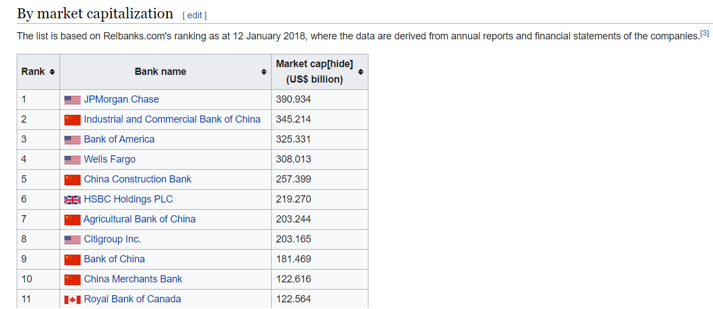
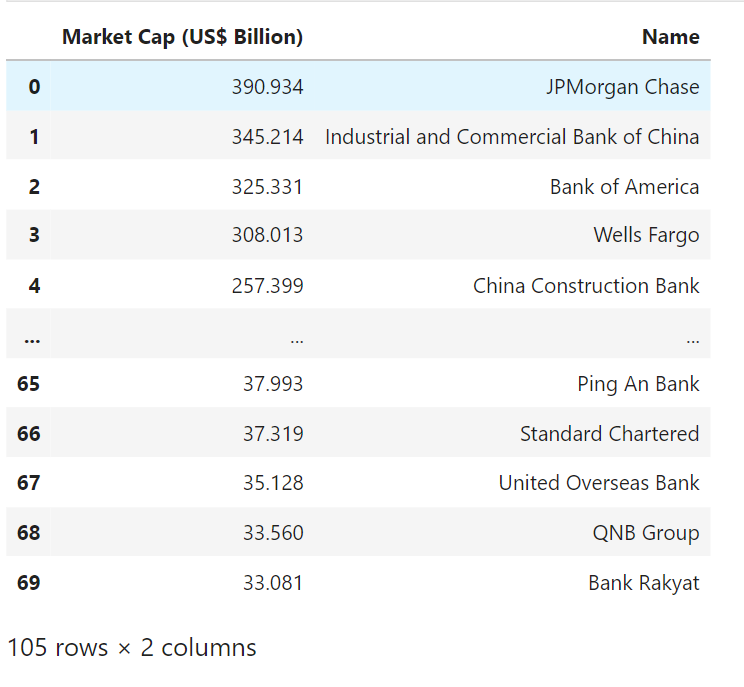
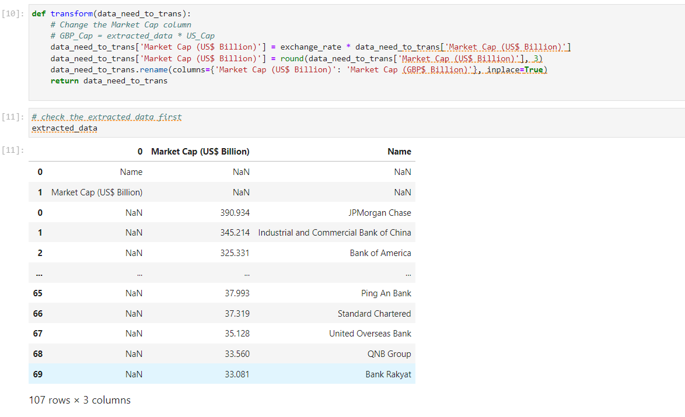
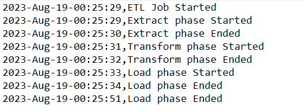

# ETL Python Project for Data Engineering

## Project Description:
This project involves a data engineer role at an international financial analysis company. The goal is to extract financial data from sources like websites, APIs, and provided files, focusing on stock prices, commodities, forex rates, and inflation rates. Extracted data is then transformed to match company needs through cleaning, normalization, and aggregation. Finally, the refined data is loaded into a centralized database, enabling efficient analysis and reporting. The project aims to enhance financial decision-making by ensuring accurate and well-organized data for clients and analysts.

This project is from **"Python Project for Data Engineering"** course offerred by **IBM** in **Coursera**. 

Key Project Tasks:
* Collect data using APIs
* Collect data using webscraping.
* Download files to process.    
* Read csv, xml and json file types.
* Extract data from the above file types.
* Transform data.
* Use the built in logging module.
* Save the transformed data in a ready-to-load format which data engineers can use to load the data.

## Data source:
>The below wikipedia webpage provides the information about largest bank in the world by various parameters.  
>**link**: https://en.wikipedia.org/wiki/List_of_largest_banks

## Solution:

### Extract
> First, scrape the list of the banks in the world as measured by market capitalization  
  
> The list is based on Relbanks.com's ranking as at 12 January 2018, where the data are derived from annual reports and financial statements of the companies.
> using Requests library will help to get instance of data and provide a simple API for interacting with HTTP operations. 
> and BeautifulSoap library for handling the data to be declared in DataFrames, and Using ExchangeRate-API we will extract bank_market_cap data. 
> And then, Load the file exchange_rates.csv as a dataframe and find the exchange rate for British pounds with the symbol GBP, store it in the variable
> exchange_rate, you will be asked for the number. 
>  

### Transform
> In Transforming phase, I used exchange_rate and the exchange_rates.csv file find the exchange rate of USD to GBP. 
> so, transform function changes the Market Cap (US$ Billion) column from USD to GBP Rounds the Market Cap (US$ Billion) column
> to 3 decimal places, and the I renamed Market Cap (US$ Billion) to Market Cap (GBP$ Billion). 
> 

### Load
> In the load phase, I created a function that takes a dataframe and load it to a csv named bank_market_cap_gbp.csv. 
> and the logging function *log* to log the data.
> 

